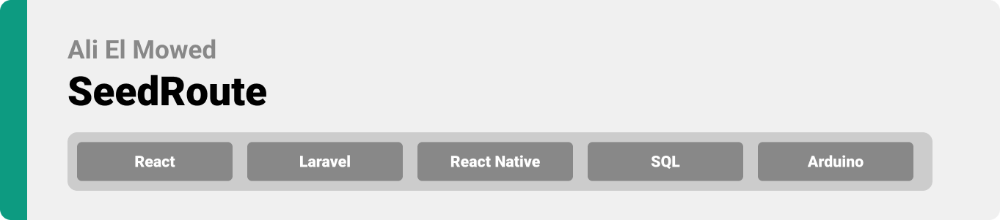

# SeedRoute


>Hello world! This is the project’s summary that describes the project plain and simple, limited to the space available. 
<br>

> **[PROJECT PHILOSOPHY](https://github.com/Ali-ElMowed/SeedRoute/blob/master/README.md#project-philosophy) • [WIREFRAMES](https://github.com/Ali-ElMowed/SeedRoute/blob/master/README.md#wireframes) • [TECH STACK](https://github.com/Ali-ElMowed/SeedRoute/blob/master/README.md#tech) • [IMPLEMENTATION](https://github.com/Ali-ElMowed/SeedRoute/blob/master/README.md#implementation) • [HOW TO RUN?](https://github.com/Ali-ElMowed/SeedRoute/blob/master/README.md#run)**


> **[PROJECT PHILOSOPHY](https://github.com/Ali-ElMowed/SeedRoute/blob/master/README.md#project-philosophy) • [WIREFRAMES](https://github.com/Ali-ElMowed/SeedRoute/blob/master/README.md#wireframes) • [TECH STACK](https://github.com/Ali-ElMowed/SeedRoute/blob/master/README.md#tech) • [IMPLEMENTATION](https://github.com/Ali-ElMowed/SeedRoute/blob/master/README.md#implementation) • [HOW TO RUN?](https://github.com/Ali-ElMowed/SeedRoute/blob/master/README.md#run)**

>The SeedRoute app is a smart seeding system that assists amateur farmers through their planting experience.
>SeedRoute guides the user from seeding to harvesting, passing through all the phases.
>There are 3 daily tasks that the app completes: 

>1.Notifies the user about the land blocks watering schedule and waters it by a command from the user.<br>
>2.Informs the user about different types of plants giving with tips and recognitions.<br>
>3.Provides a space for the user to contact an advisor to ask questions.

### User Stories
- As a user, I want to access a wide variety of plants with specific recommendations and information that help me decide on planting. 
- As a user, I want to be reminded of watering the lands on certain schedule/timing.
- As a user, I want to be guided from an experienced farmer and have my questions answered.
- As a user, I want to map my land in an organized way to have a better planting experience.

### Advisor Stories
- As an advisor I prepare a profile that shows my experience in farming.
- As an advisor I accept questions from other users.
- As an advisor I chat with the users, where I can view their land as well, and give advices and answers their questions.


> **[PROJECT PHILOSOPHY](https://github.com/Ali-ElMowed/SeedRoute/blob/master/README.md#project-philosophy) • [WIREFRAMES](https://github.com/Ali-ElMowed/SeedRoute/blob/master/README.md#wireframes) • [TECH STACK](https://github.com/Ali-ElMowed/SeedRoute/blob/master/README.md#tech) • [IMPLEMENTATION](https://github.com/Ali-ElMowed/SeedRoute/blob/master/README.md#implementation) • [HOW TO RUN?](https://github.com/Ali-ElMowed/SeedRoute/blob/master/README.md#run)**

| Loading  | Login  |
| -----------------| -----|
|  | 

| Sketch Land  | My Land  |
| -----------------| -----|
|  | 


| Plants  | Plant  |
| -----------------| -----|
|  | 


| Ask Advisor animated| Ask Advisor  | Chat  |
| --------| -----------------| -----|
|  |  | 


| Block  | Watering  |
| -----------------| -----|
|  | 


<br><br>


> **[PROJECT PHILOSOPHY](https://github.com/Ali-ElMowed/SeedRoute/blob/master/README.md#project-philosophy) • [WIREFRAMES](https://github.com/Ali-ElMowed/SeedRoute/blob/master/README.md#wireframes) • [TECH STACK](https://github.com/Ali-ElMowed/SeedRoute/blob/master/README.md#tech) • [IMPLEMENTATION](https://github.com/Ali-ElMowed/SeedRoute/blob/master/README.md#implementation) • [HOW TO RUN?](https://github.com/Ali-ElMowed/SeedRoute/blob/master/README.md#run)**

Here's a brief high-level overview of the tech stack the SeedRoute app uses:

- This project uses the [React Native](https://reactnative.dev/). Which is an open-source JavaScript framework, designed for building apps on multiple platforms like iOS, Android, and also web applications.

- This project uses [TypeScript](https://www.typescriptlang.org/). Which is a strongly typed programming language that builds on JavaScript, giving you better tooling at any scale.

- For persistent storage (database), the app uses the [SQL](https://www.w3schools.com/sql/). Which is a standard language for storing, manipulating and retrieving data in databases.

- To send local push notifications, the app uses the [Expo Notification](https://docs.expo.dev/versions/latest/sdk/notifications/). Which is provides an API to fetch push notification tokens and to present, schedule, receive and respond to notifications.
  
- For Chatting the app uses [Firebase, Firestore](https://firebase.google.com/?gclid=CjwKCAjw3K2XBhAzEiwAmmgrAjkmh7XHKTv9wc7_6jIDtMuggQHsrSePnTIpqrxRkGXWxTwemlRpFxoCZ8YQAvD_BwE&gclsrc=aw.ds) and [Gifted Chat](https://www.npmjs.com/package/react-native-gifted-chat). Which is an app development platform that helps you build and grow apps and games users love . Backed by Google and trusted by millions of businesses around the world .

- And for Hardwares the app uses arduino with water pump. [Arduino](https://www.arduino.cc/en/about) designs, manufactures, and supports electronic devices and software, allowing people around the world to easily access advanced technologies that interact with the physical world

<br><br>


> **[PROJECT PHILOSOPHY](https://github.com/Ali-ElMowed/SeedRoute/blob/master/README.md#project-philosophy) • [WIREFRAMES](https://github.com/Ali-ElMowed/SeedRoute/blob/master/README.md#wireframes) • [TECH STACK](https://github.com/Ali-ElMowed/SeedRoute/blob/master/README.md#tech) • [IMPLEMENTATION](https://github.com/Ali-ElMowed/SeedRoute/blob/master/README.md#implementation) • [HOW TO RUN?](https://github.com/Ali-ElMowed/SeedRoute/blob/master/README.md#run)**

> Using the above mentioned tech stacks and the wireframes build with figma, the implementation of the app is shown as below, these are screenshots from the real app.

| Login  | Register  |
| -----------------| -----|
|  | 


| Sketch Land | My land  | Edit Profile |
| -----------------| -----| -----|
|  |  | 


| Plants  | Plant  |
| -----------------| -----|
|  | 


| Advisors  | Chats  | Notifications |
| -----------------| -----| -----|
|  |  | 


| Planted Block  | Empty Block  |
| -----------------| -----|
|  | 


> **[PROJECT PHILOSOPHY](https://github.com/Ali-ElMowed/SeedRoute/blob/master/README.md#project-philosophy) • [WIREFRAMES](https://github.com/Ali-ElMowed/SeedRoute/blob/master/README.md#wireframes) • [TECH STACK](https://github.com/Ali-ElMowed/SeedRoute/blob/master/README.md#tech) • [IMPLEMENTATION](https://github.com/Ali-ElMowed/SeedRoute/blob/master/README.md#implementation) • [HOW TO RUN?](https://github.com/Ali-ElMowed/SeedRoute/blob/master/README.md#run)**

> This is an example of how you may give instructions on setting up your project locally.
To get a local copy up and running follow these simple example steps.

### Prerequisites

First, you need to have the latest npm version installed:
* npm
  ```sh
  npm install npm@latest -g
  ```
Second, download expo go application on your mobile.

### Installation


1. Clone the repo
   ```sh
   git clone [https://github.com/your_username_/Project-Name.git](https://github.com/Ali-ElMowed/SeedRoute.git)
   ```
2. Navigate to the "client" folder and Install NPM packages
   ```sh
   npm install
   ```
3. Enter your API in `config.js`
   ```js
   const API_KEY = 'ENTER YOUR API';
   ```
4. Scan the generated QR code with your camera (ios) or through the Expo Go application (android)


